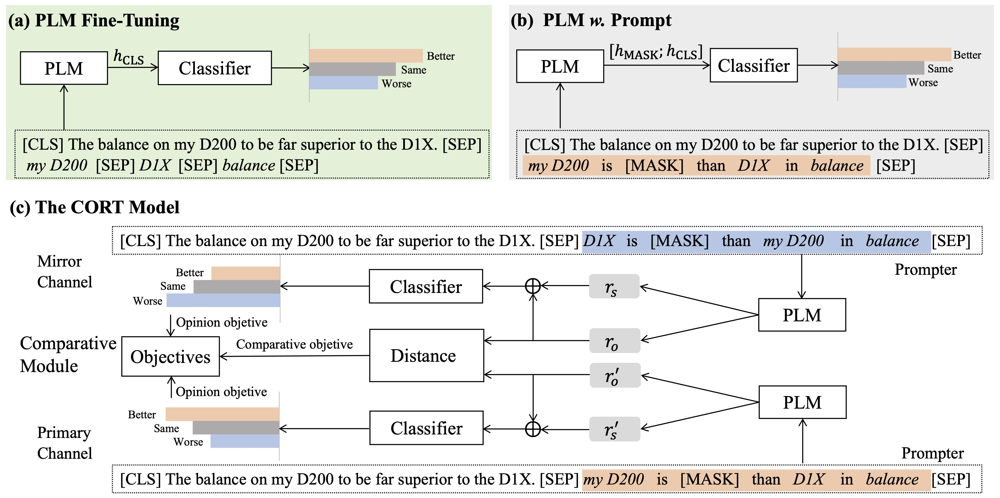

# CORT

This is the source code of EMNLP'22 paper "CORT: A New Baseline for Comparative Opinion Classification by Dual Prompts".

The CORT model contains two opinion channels , and a comparative module. Each channel includes three cells: prompter, encoder, and classifier. Given an input like (text, target t1, target t2, aspect), the prompter generates a template like “[target t1] is [MASK] than [target t2] in [aspect]”. Then the encoder encodes the original input text and the template to get a global representation and the opinion representation . Lastly, the comparative opinion is predicted by a classifier. Mirror channel and primary channel share the same configurations with the only difference on the generated template, where the two targets are swapped. See our [paper](https://openreview.net/forum?id=r0U2xA4SZER) for more details.
<p align="center"></p>

## Table of Contents
- [Setup](#Setup)
- [Usage](#Usage)
- [Citation](#Citation)

## Setup
Clone as follows:

```
git clone https://github.com/cofe-ai/cort.git
cd cort
pip install -r requirements.txt
```

Download [roberta-base](https://huggingface.co/roberta-base/tree/main), [bert-base-uncased](https://huggingface.co/bert-base-uncased/tree/main), [xlnet-base-cased](https://huggingface.co/xlnet-base-cased/tree/main) to folders `src/model/roberta-base`, `src/model/bert-base-uncased`,`src/model/xlnet-base-cased`, respectively. Each model requires vocab.json, tokenizer.json, pytotch_model.bin, config.json. Besides, xlnet and roberta require spiece.model and merges.txt, respectively.


## Usage
### Train CORT models
For CameraReview dataset, you can directly run the run_cort.py.  If you want to train other dataset, you can put the data on `./data` folder.

If you use GPU:
```
CUDA_VISIBLE_DEVICES=0 python run_cort.py  --name_model roberta  --learning_rate  1e-5   --epochs 200  --t1 0.5  --t2 0.5 --t3 1.0 --special_token '</s>'  --mask '<mask>'  --early_stop value
```
If you use CPU:
```
python run_cort.py  --name_model roberta  --learning_rate  1e-5   --epochs 200  --t1 0.5  --t2 0.5 --t3 1.0 --special_token '</s>'  --mask '<mask>'  --early_stop value  --use_gpu 0
```
The loss of train process, f1_weighted of valid process, detailed results of test process on original test-data and reversal test-data each epoch will be shown on terminal. Training model all epochs, the best model(--early_stop loss: the minimum loss on training dataset, --early_stop value: the highest f1-weighted on valid dataset.) will be save on 'save_model/'. When we save the best model, we can't use the result on test dataset, and we show the result on test data only to make easier to see the test results on each epoch. 
### Train PLM Fine-Tuning
If you use GPU:
```
CUDA_VISIBLE_DEVICES=0 python run_plm_ft.py  --name_model roberta  --learning_rate  1e-5   --epochs 200    --special_token '</s>'  
```
If you use CPU:
```
python run_plm_ft.py  --name_model roberta  --learning_rate  1e-5   --epochs 200    --special_token '</s>'  --use_gpu 0 
```
The information is similar to ```Train CORT models```.
### Train PLM w. Prompt

If you use GPU:
```
CUDA_VISIBLE_DEVICES=0 python run_plm_prompt.py  --name_model roberta  --learning_rate  1e-5   --epochs 200    --special_token '</s>'  --mask '<mask>'  --early_stop loss
```

If you use CPU:
```
python run_plm_prompt.py  --name_model roberta  --learning_rate  1e-5   --epochs 200    --special_token '</s>'  --mask '<mask>' --use_gpu 0  --early_stop loss
```
The information is similar to ```Train CORT models```.

### Reproduce our results
1. Download the [trained model](https://drive.google.com/drive/folders/1DQAjyXNeEfl3dzNGRNcfSTFdqwqLljo2?usp=sharing). Save the ```.pkl``` in ```./saved_model/roberta```
2. Run the code
```
python test.py --path save_model/roberta --name_model roberta --double 1
```


## Citation

Please cite our paper if you use this code in your work:

```
@inproceedings{DBLP:conf/emnlp/wangcort22,
  title     = {CORT: A New Baseline for Comparative Opinion Classification by Dual Prompts},
  author    = {Yequan Wang and Hengran Zhang and Aixin Sun and Xuying Meng},
  booktitle = {Findings of the Association for Computational Linguistics: {EMNLP} 2022},
  publisher = {Association for Computational Linguistics},
  year      = {2022}
}
```
